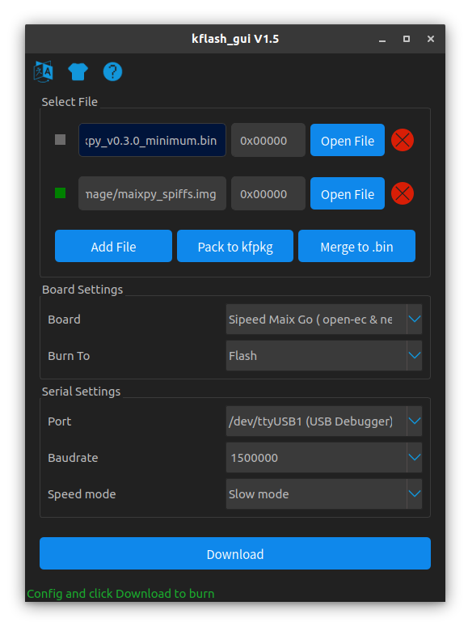
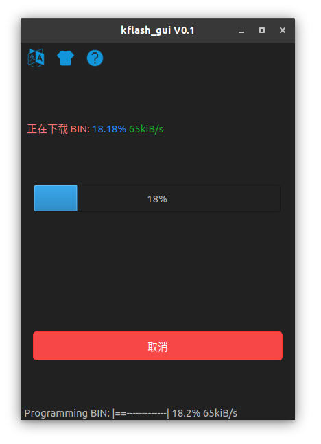
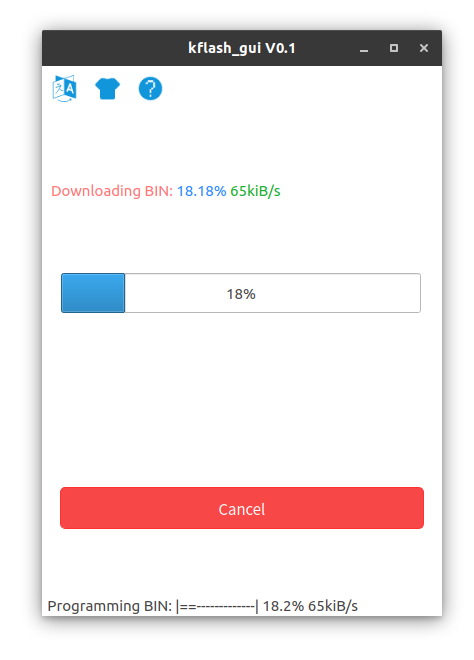
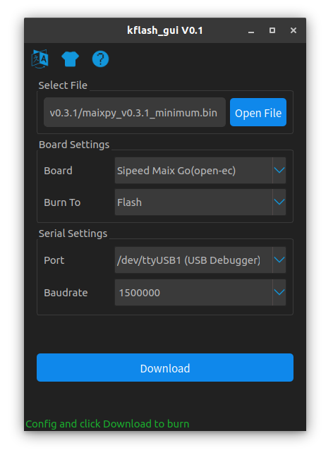

kflash_gui
=============

Cross platform GUI wrapper for [kflash.py](https://github.com/sipeed/kflash.py.git) (download(/burn) tool for k210)




## Features

* Support `*.bin` and `*.kfpgk` file with file picker
* Support development board select
* Support select where the firmware burned to
* Auto scan serial port support
* Baudrate editable
* White skin and night skin support
* Support Chinese and English Language 
* Download(/burn) progress and speed display
* Cancel download support


## Screenshots

|  |  |
| -| -|
|  |  |
|  |  |


## Usage

* Download bin file (`kflash_gui_v*.*`)  [here](https://github.com/sipeed/kflash_gui/releases)

* Compress and double click `kflash_gui.exe` or `kflash_gui`

* you can create your own shortcut by yourself； If `Linux`， edit the path in `kflash_gui.desktop`, then copy this file to `/usr/share/application` folder with administrator, and finally you can find `kflash_gui` app in the system menu

* Select `bin` file or `kfpkg` file， set address to `0x0000` if file is firmware, and set `Prefix` checkbox to enable add parity prefix
* Select board
* Select where firmware flash to, `Flash` or `SRAM`
* Select serial port
* Select baudrate, `1.5M` recommend
* Click Download to burn firmware or model to board

or you can run source code by command:

```shell
sudo apt install python3 python3-pip
sudo pip3 install -r requirements.txt
python3 kflash_gui.py
```

and pack execution package by command:

```shell
sudo pip3 install pyinstaller
python3 pack.py
```


## If download fail

* Check hardware connection
* Check board selection
* Check serial port selection
* Check baudrate, do not too high
* Check if serial occupied by other software
* Replug in USB cable and try again

## How `kfpkg` coms from

Refer here: [blog.sipeed.com/p/390.html](http://blog.sipeed.com/p/390.html)

---------------------------

## 特性

* 支持 `*.bin` 和 `*.kfpgk` 文件， 支持文件选择器选择
* 支持开发板选择
* 可选择程序烧录到 `Flash` 或者 `SRAM`
* 自动检测电脑上的串口
* 波特率可编辑
* 黑白两种皮肤可供选择
* 界面支持中英文切换
* 支持烧录进度显示和烧录速度显示
* 支持取消下载进程

## 使用方法

* 下载文件(`kflash_gui_v*.*`)  下载地址：[release页面](https://github.com/sipeed/kflash_gui/releases)

* 解压， 并双击 `kflash_gui.exe` 或 `kflash_gui`
* 
* 可以自行建快捷方式或者固定到开始页面或者固定要任务栏方便使用； 如果是 `Linux`， 可以修改 `kflash_gui.desktop` 里面的路径， 然后用管理员身份复制到`/usr/share/application` 目录， 然后就可以在系统菜单里面找到`kflash_gui`的图标了，点击即可打开

* 选择 `bin` 文件或者 `kfpkg` 文件， 如果是`bin`文件需要指定地址，如果是固件需要指定`0x0000`地址并且选择`校验头`
* 选择开发板
* 选择烧录到开发板的哪个位置 `Flash`（速度慢但是重新上电还可运行） 或者 `SRAM`（`RAM`中运行，下载快断电丢失程序）
* 选择串口
* 选择波特率，推荐`1.5M`
* 点击 `下载` 按钮来开始下载
* 如果需要取消，点击 `取消` 按钮

## 无法下载时检查

* 板子连接是否正确
* 开发板是否选择正确
* 串口是否选择正确
* 串口速度是否选择过高，可以适当降低速度试试
* 串口是否被其它软件占用
* 串口是否出了奇怪的问题，拔掉电脑连接到板子的线重新插一下试试

## 如何手动打包 `kfpkg`

`bin` 文件只能下载到 `Flash` 地址 `0x000000`, 如果需要指定地址，比如下载模型文件，则需要创建 `kfpkg` 文件然后下载

参考这里: [blog.sipeed.com/p/390.html](http://blog.sipeed.com/p/390.html)


